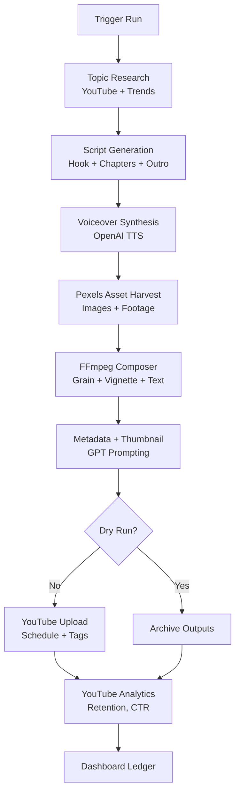

## The Midnight Bureau

Autonomous pipeline for crafting cinematic mystery & crime documentaries. The platform orchestrates:

1. **Topic Intelligence** – cross-references YouTube and trends APIs to score viral, evergreen mysteries.
2. **Narrative Engineering** – prompts GPT-based story generation with cliff-hangers, hooks, and dark documentary pacing (Hindi / English / Hinglish).
3. **Voice Synthesis** – renders slow, controlled narration through OpenAI TTS voices.
4. **Visual Assembly** – sources Pexels B-roll, builds noir sequences with FFmpeg (vignettes, film grain, typewriter overlays).
5. **Audio Design** – blends narration with cinematic beds and SFX.
6. **Metadata & Artwork** – auto-writes high CTR titles/descriptions/tags and generates thumbnails via diffusion.
7. **Publishing Loop** – uploads or schedules releases on YouTube, then pulls retention analytics for future optimisation.

The control surface lives at `/` and exposes run history, asset downloads, and KPI telemetry.

---

## Quickstart

```bash
npm install
npm run dev
```

Visit [http://localhost:3000](http://localhost:3000) to launch new investigations or inspect previous runs.

Production build:

```bash
npm run build
npm run start
```

Lint the workspace:

```bash
npm run lint
```

---

## Environment Variables

| Variable | Purpose |
| --- | --- |
| `OPENAI_API_KEY` | Required for script writing, thumbnail generation, and TTS. |
| `YOUTUBE_API_KEY` | Optional. Enables higher quality topic research via YouTube Data API v3. |
| `PEXELS_API_KEY` | Required to source cinematic B-roll and stills. |
| `BACKGROUND_AUDIO_URL` | Optional. HTTPS URL to a royalty-free underscore (MP3/WAV) mixed under narration. |
| `YOUTUBE_CLIENT_ID` / `YOUTUBE_CLIENT_SECRET` / `YOUTUBE_REFRESH_TOKEN` | Required for uploading and analytics (OAuth 2.0). |
| `BLOB_READ_WRITE_TOKEN` (or `BLOB_TOKEN`) | Optional. Persist generated assets to Vercel Blob; otherwise files stay on the local temp dir. |
| `FFMPEG_PATH` / `FFPROBE_PATH` | Optional overrides if custom binaries are preferred (defaults ship via `@ffmpeg-installer`). |

Place these in `.env.local` for local development or configure them through Vercel project settings.

---

## Pipeline Overview



---

## Notable Files

- `src/app/page.tsx` – cinematic dashboard & run launcher UI.
- `src/app/api/pipeline/route.ts` – orchestrates the pipeline end-to-end (research → analytics).
- `src/lib/pipeline/steps/*` – modular automation steps (research, script, voiceover, video, metadata, upload, analytics).
- `src/lib/pipeline/asset-store.ts` – persist artefacts to Vercel Blob or local temp storage.
- `src/components/start-pipeline-form.tsx` / `pipeline-run-list.tsx` – client components for orchestration and monitoring.

---

## Deployment

Ensure the environment variables above are configured, then:

```bash
npm run build
npm run lint
vercel deploy --prod --yes --token $VERCEL_TOKEN --name agentic-eeb5173d
```

Once deployed, validate availability:

```bash
curl https://agentic-eeb5173d.vercel.app
```

If analytics uploads are enabled, confirm the YouTube OAuth refresh token grants `youtube.upload` and `youtube.readonly` scopes.
